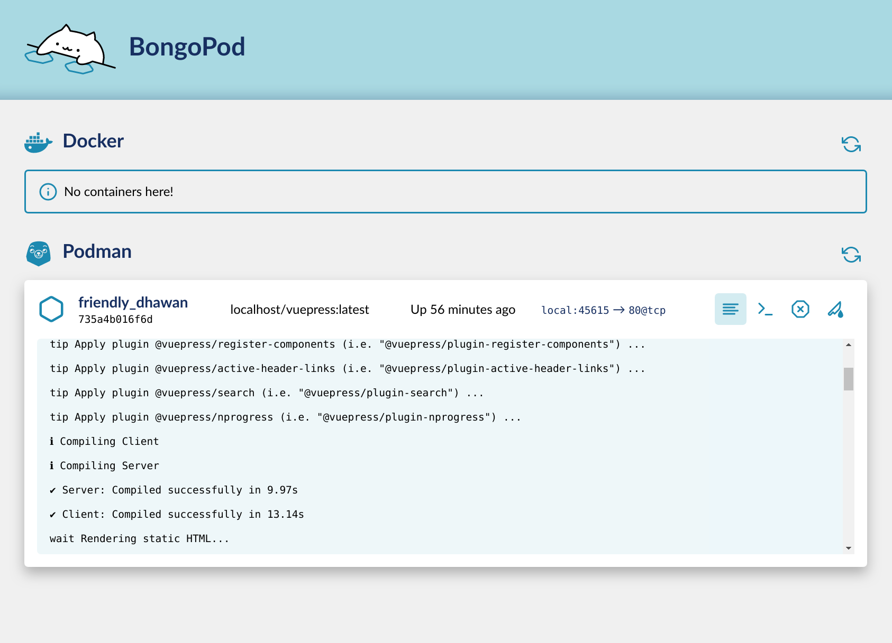

# BongoPod

A desktop app for managing your local containers driven by Docker/Podman. Made with electron, pug, stylus and pure frustration of using Docker's and Podman's CLI.

It is not made for any enterprise-gradey stuff, it just helps manage those containers while you develop a new containerized app.

**Before:**

**After:**

## Features

* Run Docker if it is not running already (on Linux)
* List pods
* Open exposed ports by clicking
* Observe a non-working "Run command" section
* Stop containers
* Or gruesomly kill them